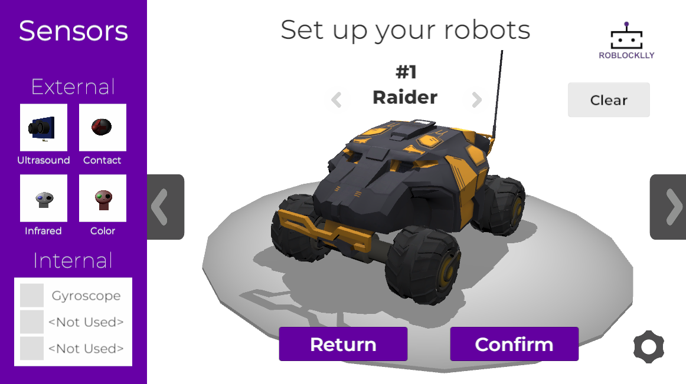
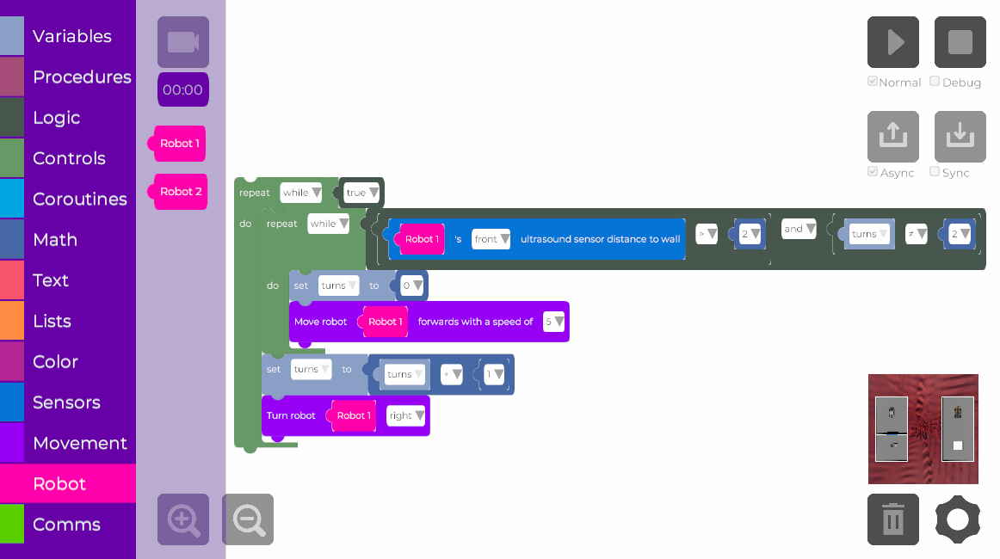

    

Source code of RoblockLLy, an educational robotics simulator based on Unity and UBlockly. This is a browser-based version of the simulator that can be accessed through the following [link](https://roblocklly.github.io/RoblockLLy/). The project requires at least Unity version 2022.3.27f1.

# Sample images

    

This is a sample of a robot available in RoblockLLy.

    

This is a solution construction with the block-based programming in RoblockLLy.

